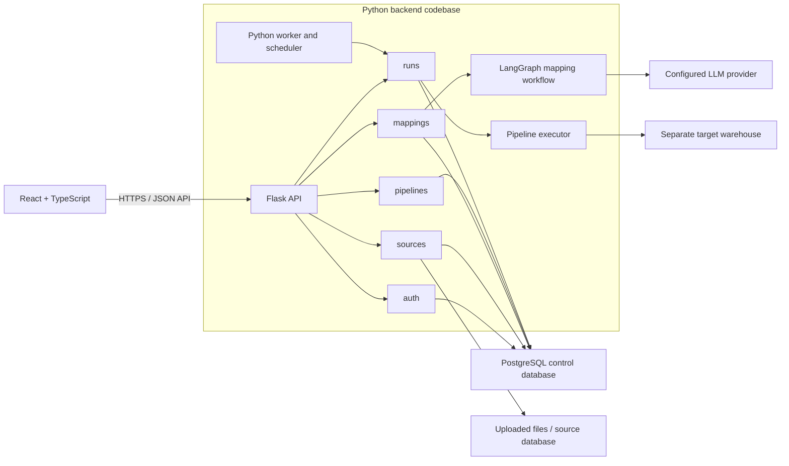

# Backend Architecture

## Purpose

This document describes a proposed backend for the GenLedge Connector MVP in D1. It supports user stories US1–US7 while keeping the application straightforward for a small team to build and maintain.

The backend is a **modular monolith**: one Flask application and one Python codebase, organized by product capability. A separate Python worker process runs longer pipeline jobs using the same application services and configuration. The worker is a process boundary for long-running work, not a separate service with its own API or data model.

## System overview



The control database stores application state. The target warehouse stores the analytics-ready output and is configured independently. Source credentials and LLM credentials are kept in deployment secrets; the database stores references and connection metadata rather than plaintext secrets.

## Backend structure

```text
src/backend/
  app/
    __init__.py          # Flask app factory and module registration
    config.py
    extensions.py        # Shared database and Flask extensions
    auth/
      routes.py
      service.py
      models.py
    sources/
      routes.py
      service.py
      models.py
      discovery.py
      connectors/
        files.py
        documentdb.py
    mappings/
      routes.py
      service.py
      agent.py            # LangGraph workflow
      validation.py
      models.py
    pipelines/
      routes.py
      service.py
      models.py
    runs/
      routes.py
      service.py
      models.py
      execution.py
      worker.py
      scheduler.py
    common/
      errors.py
      api_schemas.py
  migrations/
  tests/
```

Each capability owns its routes, service logic, and related persistence models. Routes handle HTTP concerns and delegate to services. Services contain product rules and coordinate other modules through their public service functions. Shared code in `common` is limited to cross-cutting concerns such as API errors and request/response schemas; avoid generic repository layers, message buses, and one-class-per-model abstractions unless a concrete need appears.

## Module responsibilities

| Module | D1 stories | Responsibility |
|---|---|---|
| `auth` | US1 | Sign-in, identity, and organization access checks. |
| `sources` | US2–US3 | Register source connections, accept supported file uploads, inspect source structure, and save schema snapshots. Connector-specific access stays behind this module. |
| `mappings` | US4–US5 | Ask LangGraph for routing and source-to-target mapping proposals, validate proposals, and save user edits and approvals as mapping versions. |
| `pipelines` | US5–US7 | Store pipeline configuration, the selected mapping version, target settings, and schedule configuration. |
| `runs` | US6–US7 | Create and monitor runs, execute approved configurations through one executor interface, and persist status, counts, and actionable errors. |

The React client receives a documented JSON API. Request and response schemas are defined centrally enough to keep the API consistent and can be used to generate or validate the frontend's TypeScript types. Long-running work returns a run identifier; the client reads run status through the API rather than waiting for the job in its original request.

## Main workflow

1. A user signs in. Each request that reads or changes organization data is checked against the authenticated user's organization.
2. The user uploads a supported file or registers a source database connection. The `sources` module stores the source reference and discovers fields, types, and representative samples. Schema snapshots are versioned so later mapping proposals and runs can identify what they used.
3. The user selects a target dataset. The `mappings` module gives LangGraph source and target metadata and receives a structured mapping proposal. It validates field names, target columns, types, and merge-key requirements before the proposal is available for review. It sends only the metadata and samples needed for mapping, not full production records by default.
4. The user reviews and edits the proposal. Approval saves an immutable mapping version and associates that version with the pipeline configuration. A later edit creates a new version; it does not silently change the mapping used by an existing run.
5. A manual run request or due schedule creates a pending run through the `runs` service. The Python worker claims pending work, loads the approved pipeline and mapping version, transforms and loads the data, and records progress and results. Manual and scheduled runs use this same path.
6. The frontend polls or refreshes run status and presents completion or failure details to the user.

## Execution boundary and AWS Glue path

The MVP uses a Python worker for extraction, transformation, and load. A run record is the durable source of run state; the worker claims pending runs from PostgreSQL so the first version does not require a separate message-broker service. Worker execution must prevent two workers from claiming the same run. The scheduler creates work through the same run service rather than implementing its own execution path.

Keep the execution boundary behind `runs.execution`: it accepts a run's pipeline configuration and approved mapping version, then reports progress and a final result. If later testing shows that workload size or runtime requires AWS Glue, add a Glue-backed executor behind this boundary. The API, mapping approval flow, run identifier, and status model should not depend on which executor runs the job. Glue is a future option, not an MVP dependency.

## Data ownership and failure handling

- PostgreSQL control data includes users and organizations, source connection metadata, schema snapshots, target catalog metadata, mapping versions, pipeline configuration, schedule settings, and run history.
- Uploaded raw files and source data remain outside the control tables. Use a storage/connector boundary so the storage provider can be selected for the deployment without changing mapping or pipeline rules.
- The target warehouse is separate from the control database. Pipeline writes should use staging and merge/upsert behavior when the configured target and merge key support it; failed loads must not be reported as successful.
- Mapping output is untrusted until validation and human approval. Invalid or incomplete output is returned as a reviewable error and cannot be executed.
- A failed worker run records a failed state and an actionable error summary. A retry creates a new run linked to the same approved configuration unless the user selects a newer mapping version.
- Database or source outages, invalid credentials, unsupported source types, and LLM failures should produce clear API or run errors. Do not log credentials or raw sensitive records.
- Run creation and worker claiming must be safe against duplicate requests or competing workers. Record enough run state to avoid silently losing work after a worker restart.

## D1 story coverage

| Story | Architectural support |
|---|---|
| US1 — Authentication | `auth` module and organization-scoped access checks. |
| US2 — Import data | File and database connectors in `sources`. |
| US3 — Discover source data | Versioned schema discovery and snapshots in `sources`. |
| US4 — Automatically map / route data | LangGraph proposal workflow in `mappings`. |
| US5 — Review and modify mappings | Mapping validation, edits, approval, and versioning in `mappings`. |
| US6 — Transform and load | Asynchronous Python worker and executor in `runs`. |
| US7 — Schedule and monitor | Scheduler creates runs through `runs`; the API exposes run history and status. |

## Decisions to validate with prototypes

- Confirm supported upload formats, upload storage, and how file-backed data is presented to discovery and execution.
- Test DocumentDB schema sampling and nested/repeating fields against representative mock data.
- Test worker claiming and recovery behavior with the selected deployment setup; retain the PostgreSQL-backed queue for the MVP unless measured concurrency requires a broker.
- Evaluate AWS Glue only if the Python worker cannot meet demonstrated workload or deployment requirements.
- Confirm LLM provider data-handling settings before sending any partner or customer data; development uses synthetic data.
